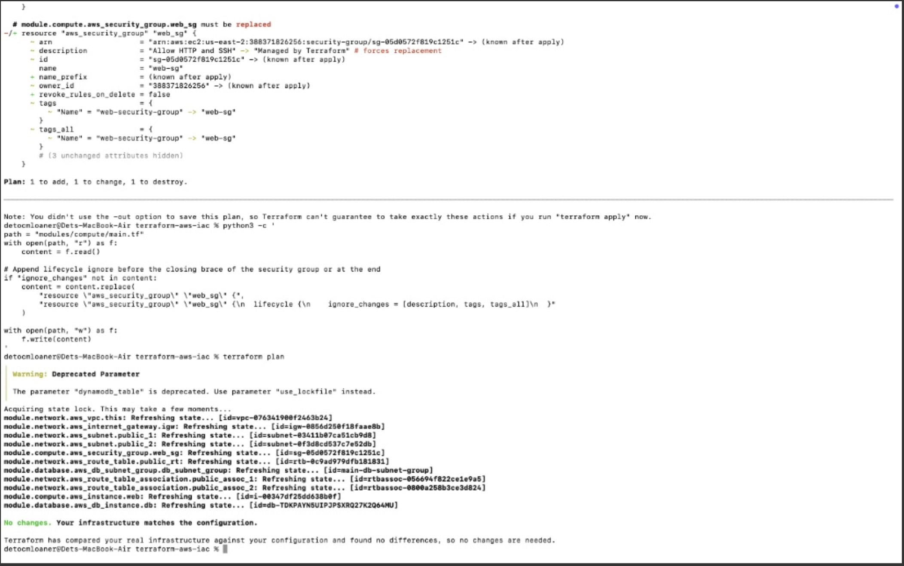
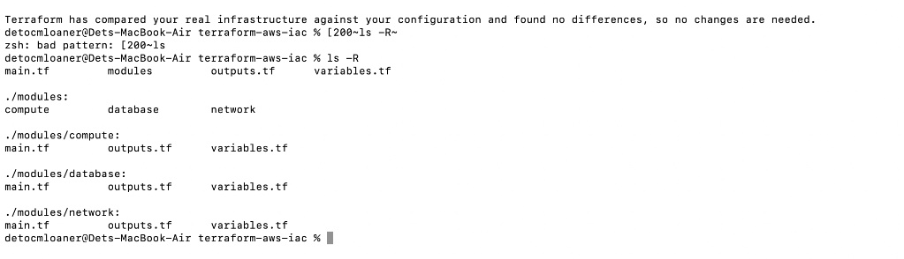
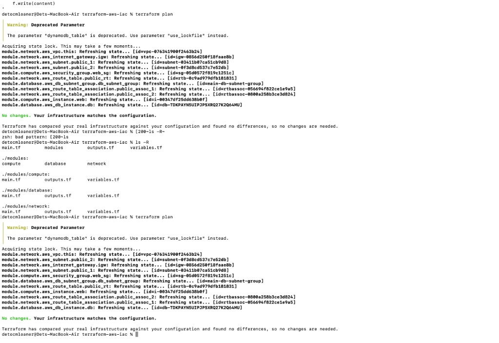
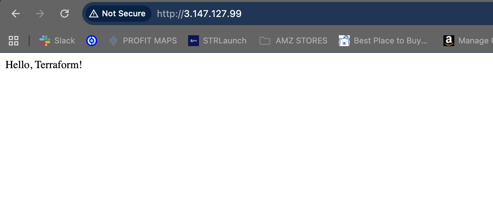

# AWS Modular Infrastructure with Remote State & Lock Management (Terraform)

## Executive Summary
Transformed a monolithic AWS infrastructure setup into a production-grade, modularized Infrastructure as Code (IaC) architecture using Terraform. Standardized remote state storage and atomic locking to ensure team scalability, safe drift resolution, and zero-downtime state refactoring.

---

## Key Achievements & Technical Scope
* **Modularized Architecture:** Provisioned a custom AWS VPC, public subnets, internet gateways, EC2 web instances, and an Amazon RDS database layer using reusable HCL modules (`compute`, `network`, `database`).
* **Remote State & Concurrency Control:** Implemented an AWS S3 remote backend paired with a DynamoDB state locking mechanism to prevent race conditions and state corruption during simultaneous executions.
* **Brownfield State Refactoring:** Successfully migrated un-modularized state into custom HCL sub-modules (`terraform state mv`) without destroying active production resources.
* **Drift Mitigation:** Debugged and resolved immutable attribute replacement issues (Security Group description updates) by inspecting execution plans (`terraform plan`) and applying targeted `lifecycle { ignore_changes }` directives.

---

## Engineering Proof of Work

### 1. State Drift Resolution & Verification
Resolved an immutable resource conflict (`# forces replacement` on Security Group descriptions) by implementing targeted lifecycle rules, transforming a destructive execution plan into a clean sync output.

### 2. Decoupled & Reusable Module Layout
Organized raw HCL files into isolated compute, network, and database modules to support DRY (Don't Repeat Yourself) design patterns across multi-environment deployments.

### 3. Remote State Storage & Lock Acquisition
Configured remote state tracking in S3 with atomic execution locks handled via DynamoDB.

### 4. Live Service Validation
Verified end-to-end network routing, security group ingress rules, and EC2 user-data initialization via the live web application endpoint.

---

## Tech Stack
* **Cloud Provider:** Amazon Web Services (VPC, EC2, RDS, S3, DynamoDB)
* **Infrastructure as Code:** Terraform (HCL v1.5+)
* **Operating System / Tooling:** macOS Zsh, Shell Automation
